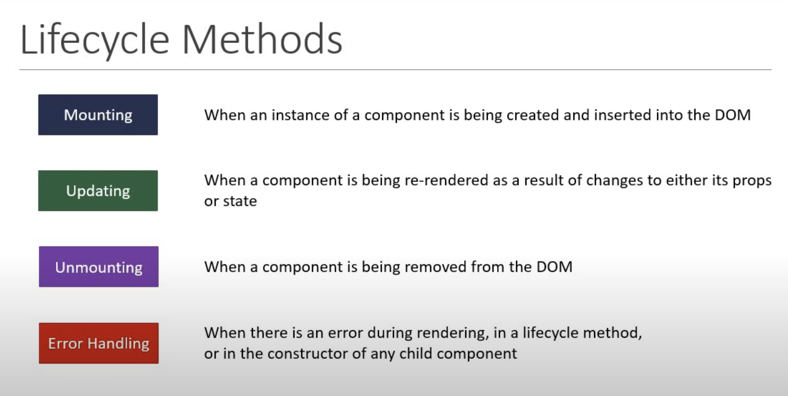
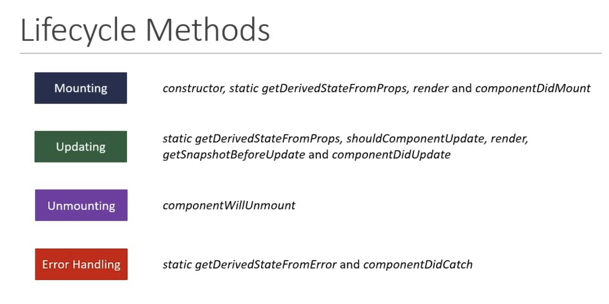
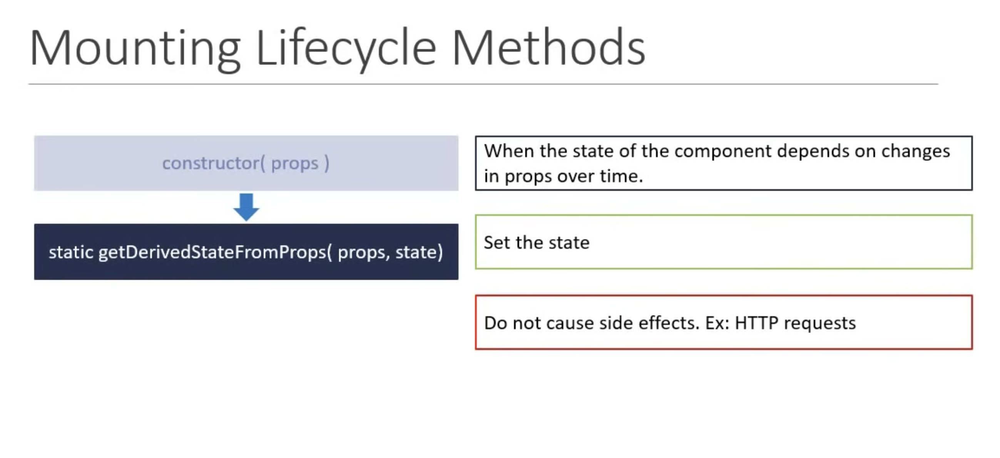

### When creating a React component, the component's name must start with an upper case letter.

# Class Based Components

## Methods at every step

### Mounting LifeCycle Methods

1. constructor(props):

2. static getDerivedStateFromProps(props, state):
* Since it is a static method, it does not have access to this keywork

