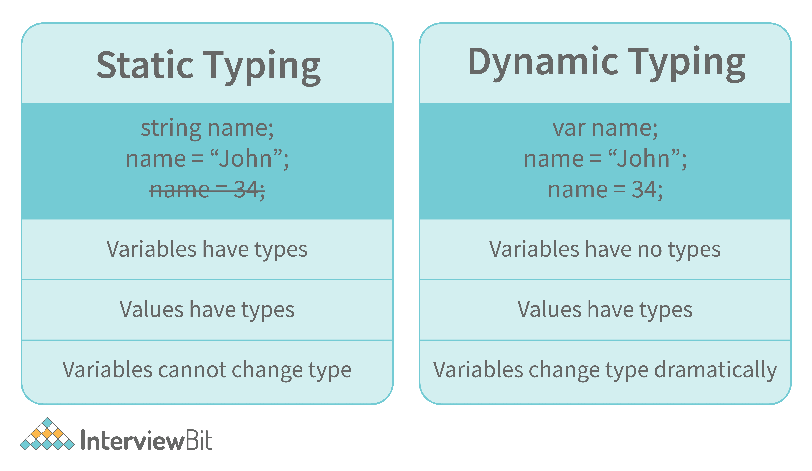

# JavaScript Notes
### Difference between var and let vs const keyword in javascript.

1. var
- Function-scoped or globally-scoped, can be re-declared and updated
- However, it allows for re-declaration and overwriting, which can lead to issues like unintended behavior when using loops or conditionals.

2. let 
- Block-scoped, can be updated but not re-declared within the same block

3. const 
- Block-scoped, cannot be re-declared or updated

#### In ECMAScript 2015, let and const are hoisted but not initialized. Referencing the variable in the block before the variable declaration results in a ReferenceError because the variable is in a "temporal dead zone" from the start of the block until the declaration is processed.

### ==
- Double Equal checks for value.
### ===
- Triple equal checks for value and type of the compared variables

### Truthy and Falsy Values
- Truthy values are those which will be converted (coerced) to true.
- Falsy values are those which will be converted to false.
- All values except false, 0, 0n, -0, “”, null, undefined, and NaN are truthy values.

### JavaScript is a dynamically typed language

### Browser Context API
- A browser context API allows you to run multiple independent browser sessions, each with their own settings, cache, cookies, and storage.

### Jitne bhi var data humare program me hota hai unhe store kahi to karna padhta hai, uske liye hota hai heap memory.
### Ek calculation ko karte waqt jo beech ka intermediate data hai, that is stored in heap memory.

### Execution Context
#### Execution is a container where the function's code is excetued, and it is always created whenever a function is called. It contain three things:
1. Variables
2. Functions inside that parent function
3. Lexical Environment of that function

#### Lexical Environment hota hai chart, jisme likha hota hai ek particular function kin cheezo ko access kar sakta hai. 
- It holds the scope and scope chain of a function

