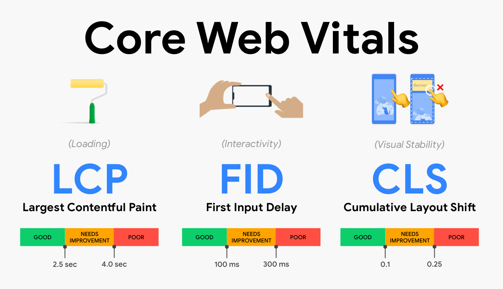

# Web Vitals

## LCP 
- ### Largest Contentful Paint
## CLS 
- ### Cumulative Layout Shift
## INP 
- ### Interaction to Next Paint

- Clicking with a mouse.
- Tapping on a device with a touchscreen.
- Pressing a key on either a physical or onscreen keyboard.
## FID - First Input Delay (FID is deprecated and will be removed in the next major release.)

#### Google runs the website throught the core web vitals it has designed and sees if a website passes those checks or not.

#### Google used Core Web Vitals as one of the ranking factors for Google SEO (Search Engine Optimization)

### How Web Vitals can be improved:
